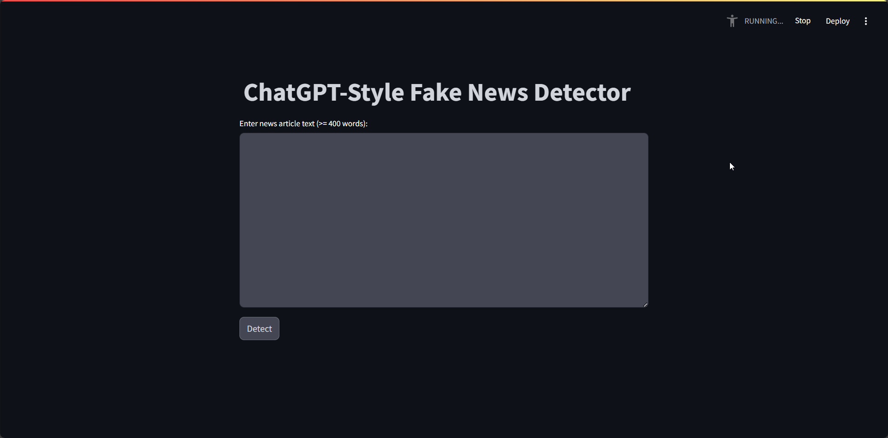
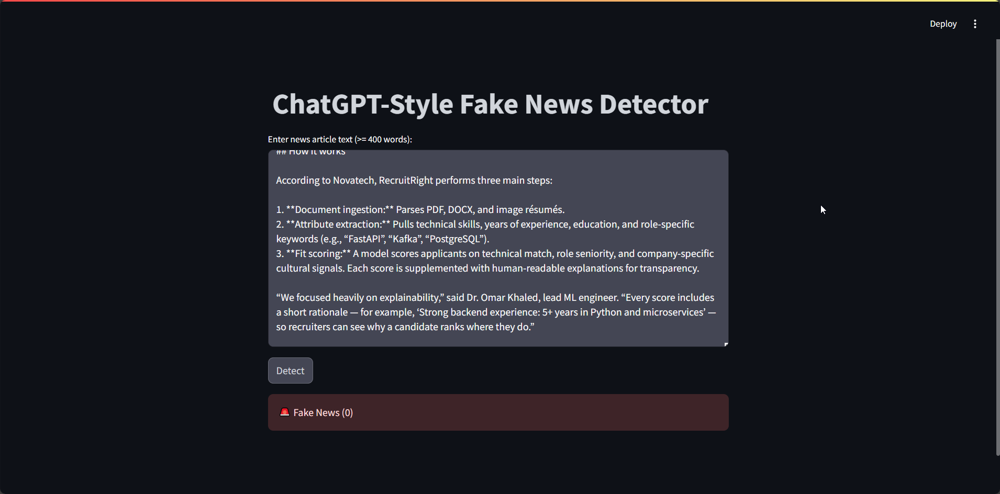

# FakeNewsDetector 📰🔍

A lightweight, Streamlit-powered LSTM model for binary fake news detection from article text.

## Badges

- 
- 

## Table of Contents

- [Demo](#demo)
- [Features](#features)
- [Installation / Setup](#installation--setup)
- [Usage](#usage)
- [Configuration / Options](#configuration--options)
- [Contributing](#contributing)
- [License](#license)
- [Acknowledgements / Credits](#acknowledgements--credits)

## Demo

Real demo assets are available in `./demo/`:

- Image 1:

  

- Image 2:

  

- Video:

  <video src="./demo/demo.mp4" width="720" controls></video>

## Features

- **Streamlit UI** for quick, interactive inference.
- **LSTMClassifier** model defined in `model.py` with embedding + (bi)LSTM + dense.
- **Robust model loading** in `utils.py` handling both state dicts and legacy full-model pickles.
- **Text preprocessing**: contractions normalization, ASCII cleaning, URL/HTML stripping, punctuation removal, stopword filtering.
- **Vocabulary-indexed encoding** via `models/word2idx.pt` with `<PAD>` and `<UNK>` support.

## Installation / Setup

```bash
# Create a virtual environment
python -m venv .venv

# Activate it
# On Linux/Mac:
source .venv/bin/activate
# On Windows:
.venv\Scripts\activate

# Install dependencies
pip install -r requirements.txt
```

## Usage

Run the Streamlit app:

```bash
streamlit run app.py
```

Then open the provided local URL in your browser. In the UI:

- Paste or type an article with at least 400 words.
- Click "Detect" to get a binary label: `1` (Real) or `0` (Fake).

Programmatic example (using internal utilities):

```python
from utils import predict

text = """Your article text goes here ..."""
label = predict(text)
print("Real" if label == 1 else "Fake")
```

## Configuration / Options

- **Model files** (required):
  - `models/model.pt` — the trained model weights (state_dict or full model).
  - `models/word2idx.pt` — vocabulary mapping containing `<PAD>` and `<UNK>` tokens.
- **Device selection**: `utils.py` uses `cuda` if available, else `cpu`.
- **Preprocessing**: adjust stopword language or cleaning rules in `utils.py` (`clean_text`).
- **Sequence length**: modify `encode(tokens, max_len=300)` to change padding/truncation length.

## Contributing

Contributions are welcome! Please:

- Open an issue describing the proposal/bug.
- Submit a focused PR with clear description and rationale.
- Keep code style consistent and include small tests or usage notes when relevant.

## License

This project is licensed under the MIT License. See [LICENSE](./LICENSE) for details.

## Acknowledgements / Credits

- **PyTorch** for model definition and inference (`torch`).
- **Streamlit** for the web UI (`streamlit`).
- **NLTK** for stopwords and text utilities (`nltk`).
- **contractions** for text normalization.
- **scikit-learn**, **pandas**, **matplotlib**, **seaborn**, **numpy**, **wordcloud**, **tqdm** used in the accompanying notebook `lstm-classifier-f1-score-99.ipynb` for data exploration, evaluation, or training workflows.
